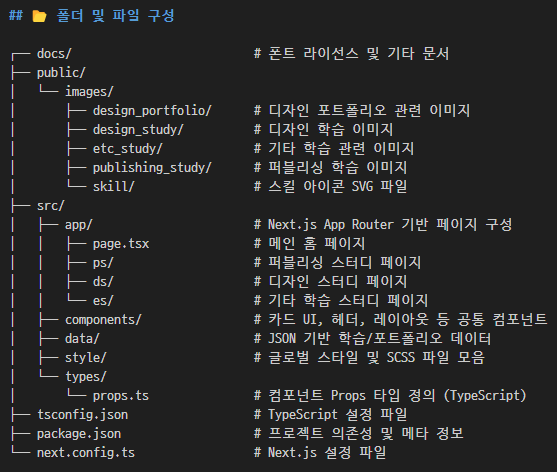
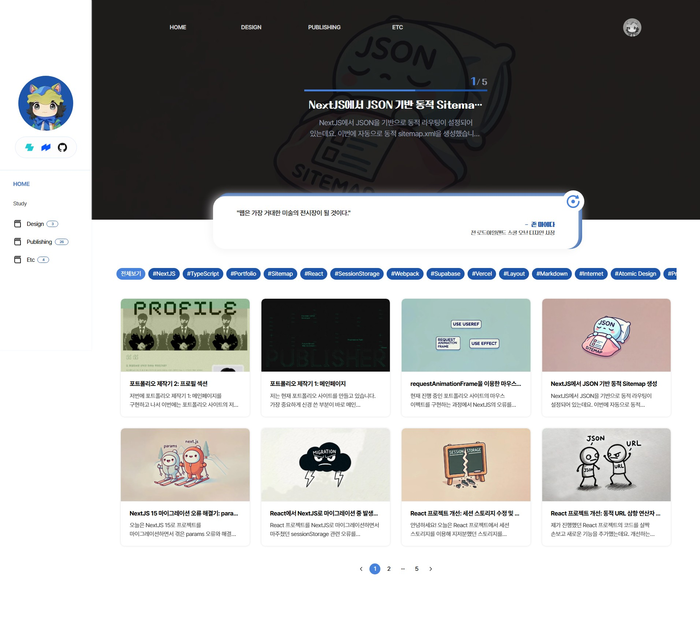
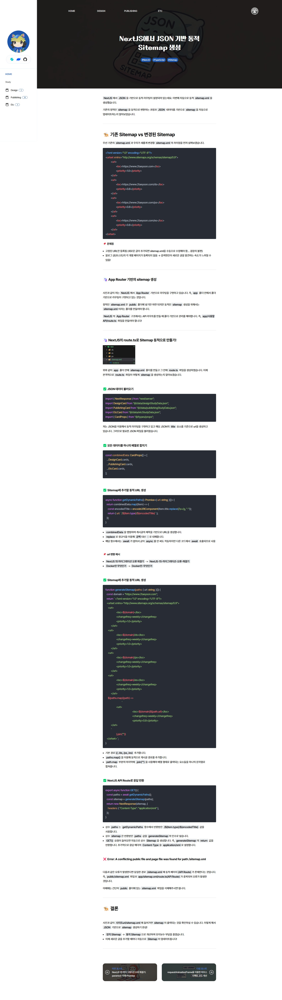
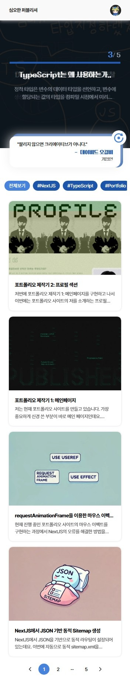
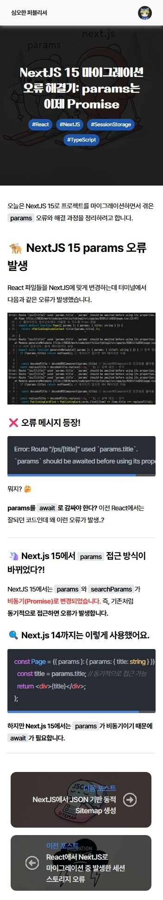

# 2taeyoon 블로그 사이트

2taeyoon은 디자인, 퍼블리싱, 프론트엔드 개발의 전 영역을 아우르는 **개인 학습 및 결과물 기록 포트폴리오 웹사이트**입니다.  
Next.js 기반으로 구축되어 있으며, 섹션별 카드 뷰와 슬라이드 뷰, 마크다운 렌더링, 태그 필터링 등을 통해 콘텐츠를 구조적으로 정리하고 제공합니다.

---

## 📌 주요 기능 및 구현

### 💡 전체 기능 요약
- **디자인 / 퍼블리싱 / 개발 스터디 콘텐츠** 분류 및 관리
- **마크다운 기반 카드 콘텐츠 렌더링**
- **이미지 + 텍스트 카드 리스트 구성 (Card, Card2)**
- **카테고리별 슬라이더 / 필터링 기능**
- **공식 이미지 파일 경로 구조 활용 (`/images/...`)**
- **Next.js 13 App Router 사용**
- **전역 스타일 구성 + SCSS 기반 컴포넌트 스타일링**

---

## 📂 폴더 및 파일 구성

---

## 🛠 사용 기술 스택

- **Next.js 13 App Router**  
- **TypeScript / SCSS Modules**
- **Markdown 렌더링 (md 파일 구성)**
- **카드형 디자인 카드 컴포넌트 (Card, Card2)**
- **반응형 레이아웃 / 슬라이드 뷰 지원**
- **마크다운 기반 콘텐츠 템플릿 자동화**
- **ESLint / Prettier / Webpack 설정 포함**

---

## ✅ 구현 포인트

- **마크다운 기반 콘텐츠 관리**  
  `/public/images/.../*.md` 파일을 통해 정적 콘텐츠를 관리하며, 이미지 + 마크다운 형식으로 웹페이지에 구성

- **App Router 활용**  
  `/ps`, `/ds`, `/es` 등의 라우팅 경로를 통해 퍼블리싱 / 디자인 / 기타 학습으로 나뉘며 각 카테고리 뷰를 정리

- **카드형 UI 컴포넌트 (Card.tsx / Card2.tsx)**  
  섹션별 미리보기 이미지 + 설명 카드 구성

- **콘텐츠 확장 용이성**  
  마크다운만 추가하면 콘텐츠가 자동 반영되도록 설계되어 있으며, 재사용성과 관리 용이성 확보

- **디자인 기반 학습 문서들 제공**  
  Atomic Design, Z/F형 레이아웃, 웹 접근성, Git, Docker, TypeScript, Webpack 등 다양한 주제를 문서화

---

## 📎 참고

- 본 프로젝트는 **개발 역량 강화를 위한 자체 설계 프로젝트**입니다.
- 모든 블로그 콘텐츠는 마크다운으로 구성되어 지속적인 업데이트 및 확장이 가능합니다.

---

## 📷 미리보기

